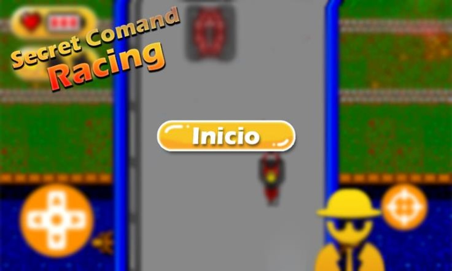
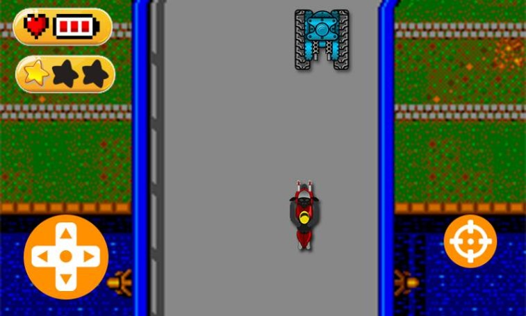
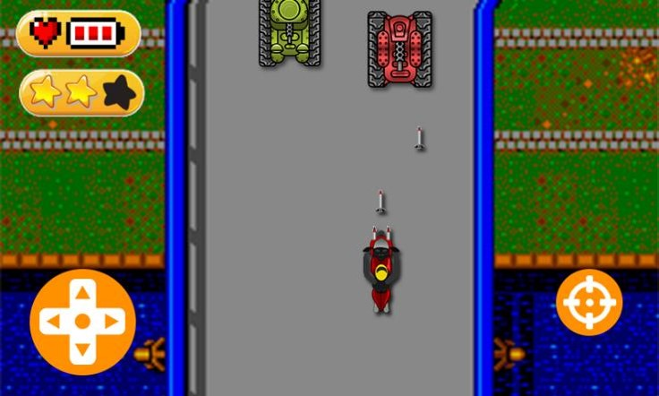
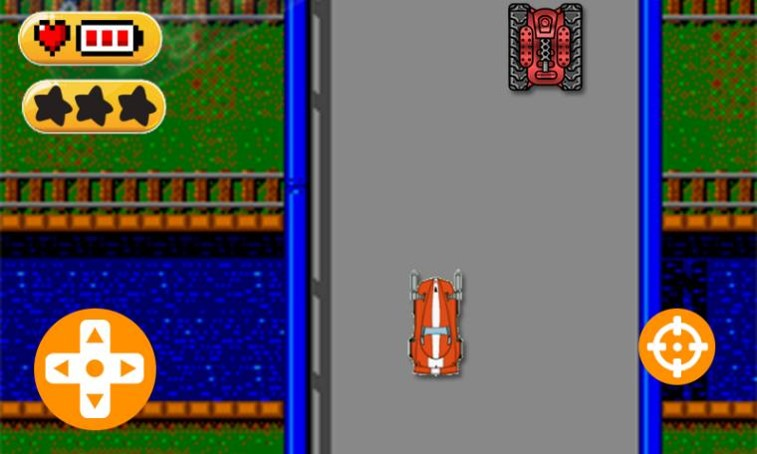

# :video_game: Sobre o Game
O Secret Command Racing se inicia em uma estrada pavimentada, o governo lhe confiou a importante missão de se infiltrar em uma área inimiga. Sua arma secreta é um veículo capaz de se aprimorar com a ajuda de um caminhão do governo, que irá dá reforços secretamente a você. O jogo foi baseado em outro game de 1986 licenciado pela Sega ltd. O Professor que orientou esse trabalho foi o Profº Vitor Almeida dos Santos
 
## :dart: Objetivos 
Destruir os veículos identificados com a bandeira inimiga, evitando colidir com os 
demais veículos para não chamar atenção da força inimiga. Sua pontuação aumenta de acordo 
com o tempo gasto na missão. 
 
## :gem: Regras (pontos, vidas, como o jogo acaba etc): 
A pontuação aumenta com o tempo vivo em missão, você terá apenas uma única chance, o auxílio do governo só pode lhe ajudar quando 
você tiver destruído um número ‘x’ de inimigos. O jogo termina quando você destruir 3 
bloqueios inimigos ou quando for atingido por algum inimigo.

## 🎨 Desing

 
 
 
 

## 🛠 Tecnologias
 * Lua
 * CoronaSDK (Solar 2d)

## 🕹 Como Executar
 ### Pré-Requisito
  * Instalar o Corona SDK e abrir o arquivo "main.lua"

## :tv: Funcionanando
Assista ao game funcionando, [clique aqui!](https://youtu.be/XMTqdgveVZY)

<h4 align="center">
  🚧 Em construção v2.0 ... 🚧
</h4>

### Features v2.0
- [x] Versão 1.0
- [ ] Misseis
- [ ] Inimigos Radomicos 
- [ ] Upgrade de Veiculo
